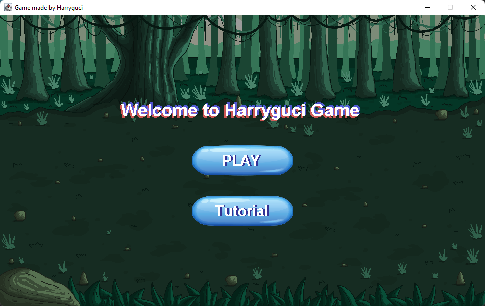
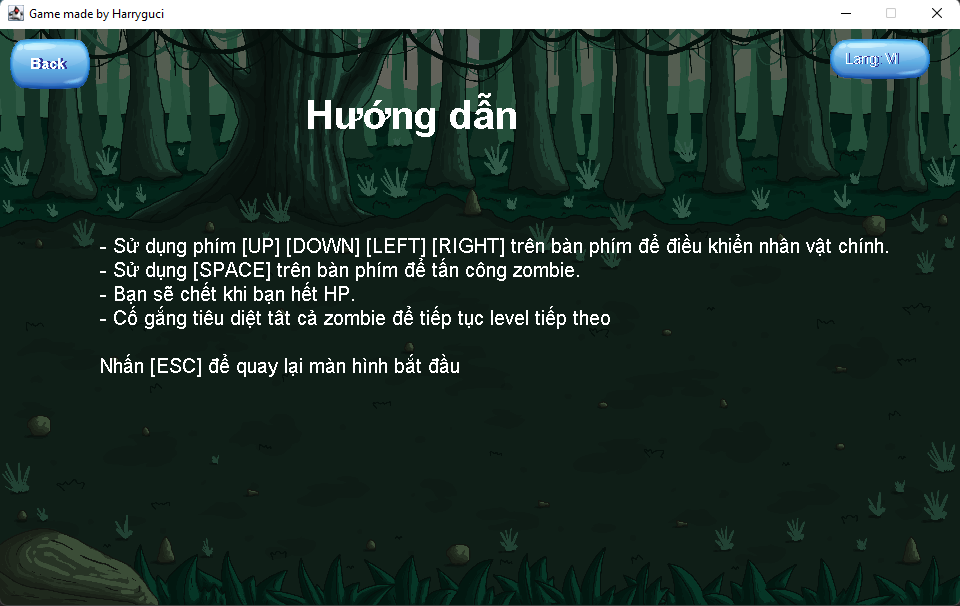
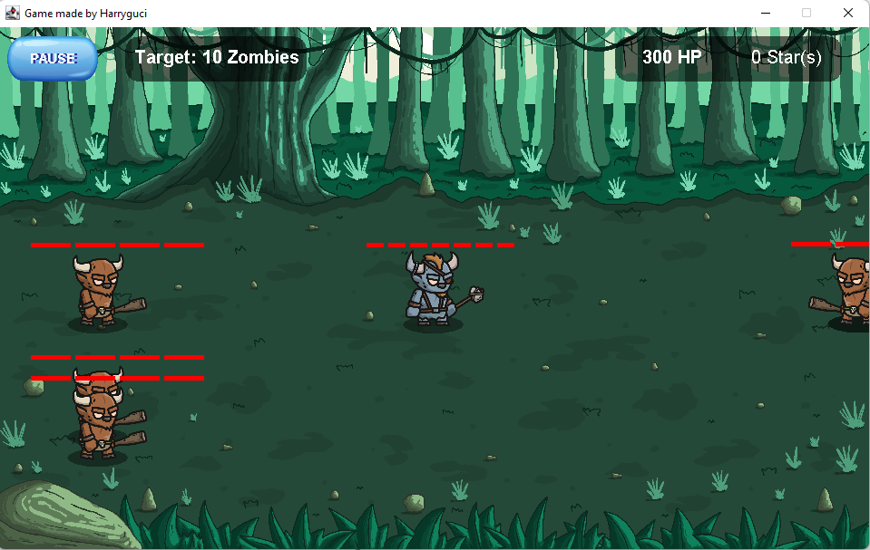
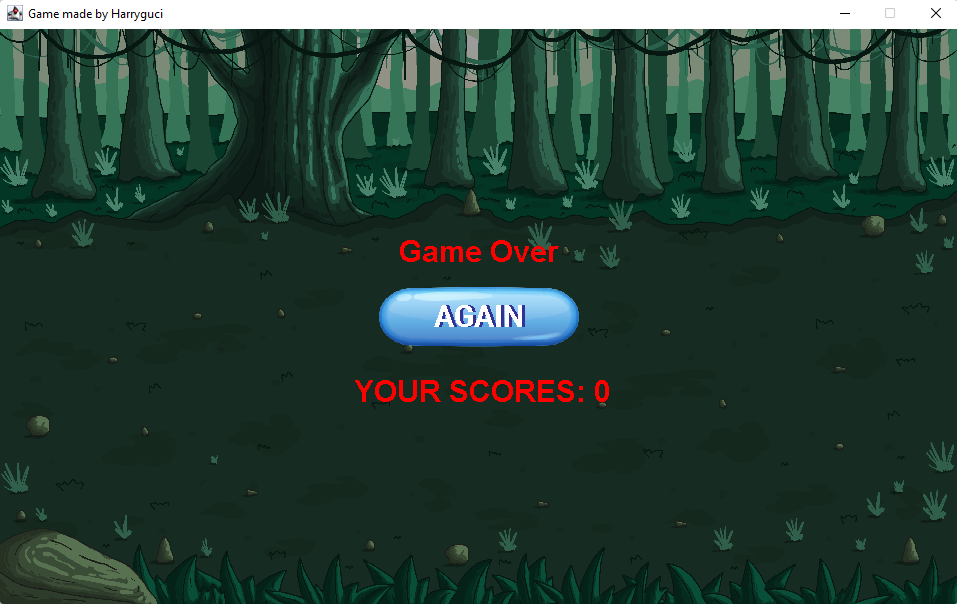

# This game was built using Java: Swing.

- The project to reference about structure which is a popular game structure.

## Folder tree

- .idea
- out
- src
    + bin: test files
    + Entity: Entity files (Player, Zombie, ...)
    + Game: Game files for running
    + resources: Game resources
    + util: handling component
- First Game.iml
- README.md

## Some Images

